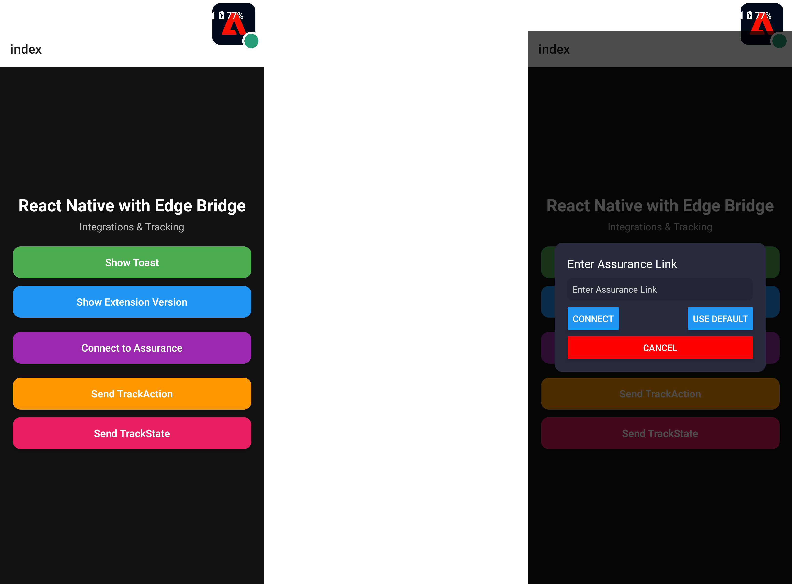

# 📱 React Native Integration with Edge Bridge

This project is an [Expo](https://expo.dev) React Native app that integrates **Adobe Experience Platform** using Edge Bridge and allows connecting to an Assurance session via a custom link.
You can use to demonstrates **trackAction** and **trackState** usage with a `HashMap` style payload.



---

## 🚀 Features
- Connect to Adobe Assurance using a user-provided link or a default link.
- Show popup if an Assurance session is already running.
- Send `trackAction` and `trackState` events.
- Support for `HashMap`-style payloads.
- Works on **physical devices** as well as emulators.

---

## ⚙️ Setup Instructions

### 1️⃣ Install Dependencies
```
npm install
If you get tslib missing errors when running, do the following:

npx expo prebuild
npm install @adobe/react-native-aepcore @adobe/react-native-aepedgebridge tslib
npx react-native run-android
```
#### 2️⃣ Configure Adobe App ID & Assurance Link
```
Open app > index.js file and update these values:

const DEFAULT_LINK = "YOUR ASSURANCE LINK HERE"; // Example: testadobe://?adb_validation_sessionid=xxxxxxxx
MobileCore.initializeWithAppId("YOUR APP ID HERE"); // Example: launch-xxxxxxxxxxxx
```
Where to find these:

App ID → In Adobe Launch / Data Collection UI, under your environment settings.

Assurance Link → In Adobe Assurance UI when you create a new session.

#### 3️⃣🛠 Using the App

Click on Connect to Assurance.

Enter your Assurance session link OR choose the default link.

Send Tracking Events.

trackAction and trackState are available with custom data payloads.